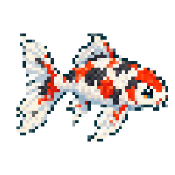

# 摸鱼搭子 · Screen Fishing

一个可随时放下的 Windows 桌面钓鱼小游戏。右键桌宠抛竿，中鱼后点击收杆，收集鱼类、特殊事件与成就。



当前版本：1.11.2 公开测试版。152种鱼、4个鱼包、60项特殊事件、71项成就；纯本地存档，无账号、无内购。

## 直接游玩

在 [下载页面（Releases）](https://github.com/CraneJinse/screen-fishing/releases/tag/v1.11.2) 下载 [ScreenFishing-1.11.2-windows-x64.zip](https://github.com/CraneJinse/screen-fishing/releases/download/v1.11.2/ScreenFishing-1.11.2-windows-x64.zip)，完整解压到可写文件夹，双击 ScreenFishing.exe。不要直接在压缩包内运行，也不要只复制 exe。Windows x64 运行包已带 Electron，无需自行安装 Node.js。

GitHub 的 Source code 压缩包是开发源码，需要按下面步骤构建。当前未提供安装器、自动更新或代码签名；不要关闭系统防护，确认下载来源后再决定运行。

第一次使用可看 [下载步骤说明](docs/DOWNLOAD_GUIDE.md)。

## 基本操作

- 右键人物/船：抛竿、收杆、切换水域、打开信息面板。
- 中鱼时点击人物/船收杆；按住拖动可移动桌宠。
- Ctrl+Shift+M：显示/隐藏桌宠；Ctrl+Shift+F：信息面板（可在设置修改）。
- 默认静音；新档首杆10秒（含抛竿动画），第2–5杆等待30–90秒，第6杆起5–10分钟。前30秒上钩提醒，之后平缓持竿并保留静止黄色叹号，随时收杆，不超时逃脱。
- 鱼获卡显示10秒；关闭面板不会退出游戏。退出请使用托盘菜单或设置中的退出。
- 默认只有淡水F1；卖鱼得金币，依次解锁F2/S1/S2，咸水鱼需要主动切换到咸水。

- 新存档默认显示本杆已用时间（非倒计时），可在设置关闭“显示抛竿计时”。

## 存档与升级

存档位于程序同目录 user-data/。新目录不带此文件夹时从0开始。升级前从托盘退出并备份完整 user-data，再将它复制到新版本程序同级目录。不要将存档提交到公共仓库。详见 [存档与隐私](docs/SAVE_AND_PRIVACY.md)。

## 从源码运行

Windows x64，Node.js 24 LTS 与 npm。依赖版本已锁定：

```powershell
npm ci
npm run check
npm test
npm start
```

构建便携包：`npm run build`。输出在 dist/，已存在的同名输出不会被覆盖，请先备份并移走旧输出。开发版存档也应避免提交。

## 测试和文档

- [游戏百科](docs/encyclopedia/GAME_ENCYCLOPEDIA.md)
- [发布前测试方案](docs/TEST_PLAN.md)、[测试报告](docs/TEST_REPORT.md)
- [构建与贡献说明](CONTRIBUTING.md)、[更新日志](CHANGELOG.md)
- `npm run verify:progression` 核验模拟器与真实状态机；`npm run simulate` 运行200组新档模拟。
- `npm run verify:ui` 和 `npm run verify:achievements` 使用隔离数据测试窗口，会短暂出现测试窗口。

## 许可

自有代码使用 [MIT](LICENSE)。美术及第三方内容不自动适用 MIT，详见 [素材声明](ASSET_NOTICE.md) 和 [第三方说明](THIRD_PARTY_NOTICES.md)。

应用程序文件、任务栏和系统托盘均使用图鉴锦鲤；上钩叹号为透明像素图案，待收杆时保持静止黄色。

## 反馈问题

在 [Issues](https://github.com/CraneJinse/screen-fishing/issues) 点击 New issue，选择问题反馈或功能建议。请附游戏版本、Windows版本和复现步骤。

## 定制角色

信息面板提供“角色库”，内置经典搭子、柠檬和亡灵船长，新存档也可直接切换；支持完整自定义角色套装导入。设计按人物、船、鱼竿顺序进行；未完成动画的草稿显示“制作中”。定制外观不改变钓鱼计时与收藏进度。

[角色设计skill安装与使用](docs/CHARACTER_DESIGN_SKILL.md) · [角色库设计](docs/specifications/characters/CHARACTER_LIBRARY_V1.md)

### 新搭子：亡灵船长


骷髅海盗、幽灵木船与脊骨钓竿，已包含完整22组动作。打开信息面板→角色库→使用角色即可切换，无需额外导入。
